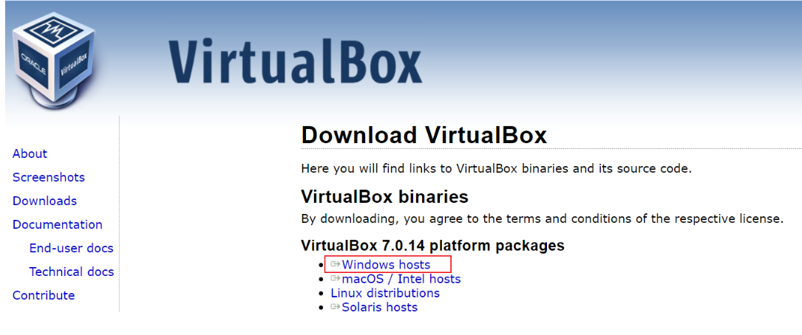

# Setting Up Your Enviroment For Devops Training.
## Tools Required to be Installed
- Visual Studio Code.
- Git.
- Virtual box.
- Ubuntu on Windows/Mac.

## Accounts to be Created

1. Github Account.
2. Amazon Web Services (AWS) Account.

# Installation of the software tools: 

### Install Visual Studio Code

Visual Stuido Code Link: [Download Visual Code](https://visualstudio.microsoft.com/downloads/)

- Choose the download option based on your device operating system type and Architecture - Mine is Windows OS X64 bit

- Open the downloaded file and run installation.
- After Installation is complete, search and open Visual studio Code

### Install Git

Git download Link: [Git](https://git-scm.com/downloads)

- Choose the download option based on your device operating system type and Architecture - Mine is Windows OS

- Open the downloaded file and run installation.
- After Installation is complete, search and open Git

### Download Virtual Box

- Choose the download option based on your device operating system type and Architecture - Mine is Windows OS

- Open the downloaded file and run installation.
- After Installation is complete, search and open Virtual Box

### Github Account

- Sign up an account on github [Github](https://github.com/)

- Provide all the information required to create an account on github

### Create AWS Account

- Visit AWS webpage to create an account 
[Amazon Web Service](https://aws.amazon.com/)

- Provide all the information required to create an account on AWS
- Account should be ready and would look like this when it's done.

